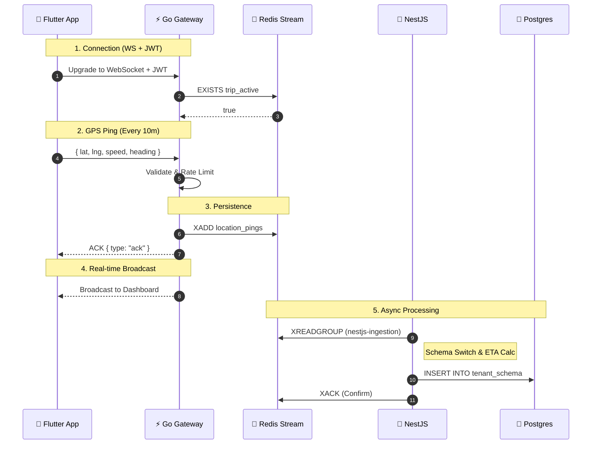

## 🛰️ 10-Minute GPS Ping — End to End Design

This diagram illustrates the high-concurrency pipeline from the Flutter driver app through the Go Gateway to the NestJS business engine.

```mermaid
sequenceDiagram
    autonumber
    participant App as 📱 Flutter App
    participant Go as ⚡ Go Gateway
    participant Redis as 🔴 Redis Stream
    participant Nest as 🔺 NestJS
    participant PG as 🐘 Postgres

    Note over App, Go: 1. Connection (WS + JWT)
    App->>Go: Upgrade to WebSocket + JWT
    Go->>Redis: EXISTS trip_active
    Redis-->>Go: true

    Note over App, Go: 2. GPS Ping (Every 10m)
    App->>Go: { lat, lng, speed, heading }
    Go->>Go: Validate & Rate Limit

    Note over Go, Redis: 3. Persistence
    Go->>Redis: XADD location_pings
    Go-->>App: ACK { type: "ack" }

    Note over Go, App: 4. Real-time Broadcast
    Go-->>App: Broadcast to Dashboard

    Note over Redis, PG: 5. Async Processing
    Nest->>Redis: XREADGROUP (nestjs-ingestion)
    Note right of Nest: Schema Switch & ETA Calc
    Nest->>PG: INSERT INTO tenant_schema
    Nest->>Redis: XACK (Confirm)
```
